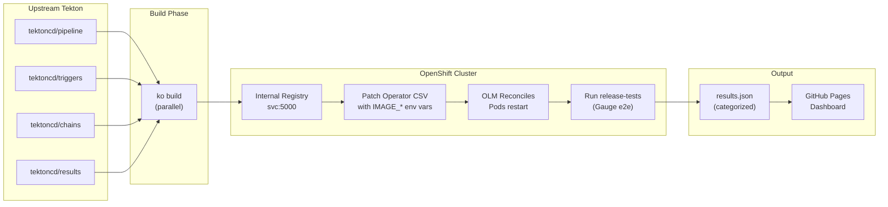
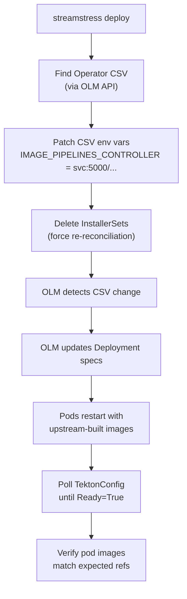
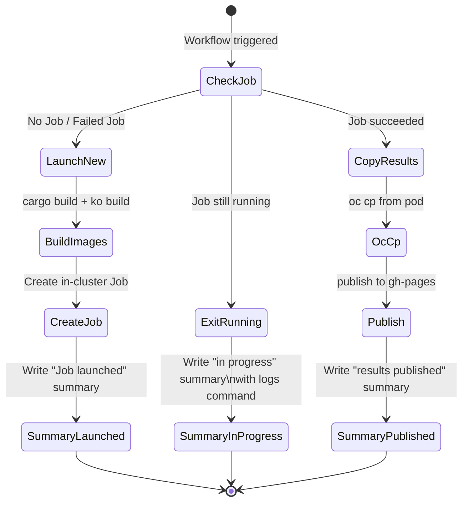
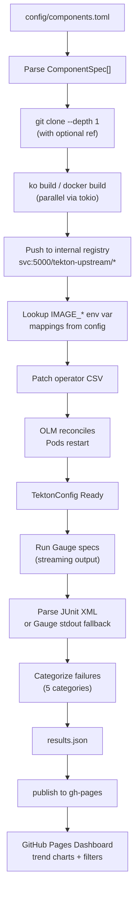

# Streamstress — Design Document

## Problem Statement

OpenShift Pipelines ships a downstream build of upstream Tekton. When upstream Tekton makes changes — new features, refactors, dependency bumps — those changes can break the OpenShift Pipelines integration in ways that aren't visible until the midstream sync happens. By that point, the breakage is expensive to diagnose and fix: multiple changes have landed, the original authors have moved on, and release timelines are at risk.

**We need a way to continuously test upstream Tekton against a live OpenShift cluster to catch breakages early — ideally the same day they land.**

## Solution Overview

Streamstress is a Rust CLI that automates the full regression testing loop:

1. **Build** upstream Tekton components from source
2. **Deploy** them into a running OpenShift Pipelines installation via the operator
3. **Test** against the release-tests suite
4. **Report** results with categorized failures and trend analysis



## Architecture

### Component Support

Six Tekton components are supported, each with its own upstream repo, build system, and image mappings:

| Component | Upstream Repo | Build System | Images |
|-----------|--------------|--------------|--------|
| pipeline | tektoncd/pipeline | ko | controller, webhook, entrypoint, nop, workingdirinit, resolvers |
| triggers | tektoncd/triggers | ko | controller, interceptors, webhook |
| chains | tektoncd/chains | ko | controller |
| results | tektoncd/results | ko | api, watcher, retention-policy-agent |
| manual-approval-gate | openshift-pipelines/manual-approval-gate | ko | controller, webhook |
| console-plugin | openshift-pipelines/console-plugin | docker | console-plugin |

Components are configured in `config/components.toml` — adding a new component means adding a TOML entry with its repo URL, build paths, and `IMAGE_*` env var mappings.

### Deployment Strategy: OLM-Aware Image Swap

The key architectural decision is **how** we get upstream-built images into the operator-managed deployment. We patch the ClusterServiceVersion (CSV), not the Deployments directly:



Why CSV, not Deployment? OLM owns the Deployments. Direct deployment patches get reverted on the next OLM reconciliation. CSV changes propagate through OLM's normal reconciliation path.

After patching, we delete InstallerSets to force the operator to re-create them with the new image references, then poll TektonConfig until the Ready condition is True and pods are running the expected images.

### Execution Modes

**Interactive (local):**
```
streamstress run --components pipeline,triggers
```
Builds locally, then creates an in-cluster Kubernetes Job for deploy+test. The Job runs a containerized copy of the CLI with the full toolchain pre-installed. Users monitor via `streamstress logs`.

**CI (GitHub Actions):**
```yaml
- run: streamstress run --components pipeline
```
Same flow, triggered via `workflow_dispatch` with cluster credentials as inputs. The workflow detects whether a Job is already running, avoids duplicates, and copies results from the completed pod to publish to the dashboard.

**Granular control:**
```
streamstress build --component pipeline
streamstress deploy --component pipeline --registry <url>
streamstress test --tags e2e --release-tests-ref master
```
Individual subcommands for when you need to run just one phase.

### Auto-Setup

When pointed at a bare OpenShift cluster, the CLI automatically:

1. Enables the internal image registry route (`defaultRoute: true`)
2. Creates the `tekton-upstream` namespace with image-puller RBAC
3. Installs the OpenShift Pipelines operator via OLM Subscription
4. Waits for TektonConfig CR to become Ready

This means zero manual cluster preparation. The `check --fix` command runs these steps explicitly; `build`, `deploy`, and `run` commands run them implicitly.

### Test Results & Failure Categorization

After tests complete, the CLI parses results from JUnit XML (primary) or Gauge stdout (fallback) and categorizes each failure:

| Category | Pattern | Example |
|----------|---------|---------|
| Missing Component | "chains", "manual-approval", "knative" | Test requires a component that wasn't deployed |
| Upgrade Prerequisite | "upgrade" + "namespace"/"setup" | Test assumes upgrade state that doesn't exist |
| Platform Issue | "uid_map", "buildah+namespace" | OpenShift-specific constraint, not upstream bug |
| Config Gap | Missing secrets/auth | Cluster configuration incomplete |
| **Upstream Regression** | Default | Likely an actual upstream breaking change |

This categorization eliminates manual triage: the team can focus on "Upstream Regression" failures and ignore known platform gaps.

Output is a structured JSON file (`results/results.json`) with per-test pass/fail, duration, error messages, and category assignments.

### Resource Profiling

With `--profile`, the CLI collects per-spec CPU/memory/pod-count metrics via the Kubernetes Metrics API during test execution. It produces:

- Per-spec peak CPU, peak memory, pod count
- Statistical summaries (min/max/avg/p95)
- A parallelism recommendation: "You can safely run N specs in parallel given your cluster's resources"

This data informs future parallelization strategies — knowing that Spec A uses 2GB and Spec B uses 500MB determines how they should be partitioned.

### Dashboard

The `publish` subcommand pushes results to a GitHub Pages site with:

- **Trend charts** (D3.js) — pass/fail rates across runs
- **Per-test tables** — expandable rows with failure details
- **Filters** — by category, status, component, date range, search text
- **Run comparison** — diff two runs to highlight regressions
- **URL state** — filter settings persist in the URL for sharing

Dashboard assets are bundled in the CLI and copied to the `gh-pages` branch on every publish, so updates propagate automatically.

### CI/CD Workflow

The GitHub Actions workflow supports a three-phase execution model:

| Trigger | What Happens |
|---------|-------------|
| First run | Builds images, creates in-cluster Job, exits with "Job launched" summary |
| Re-run while Job active | Detects running Job, exits with "in progress" summary + logs command |
| Re-run after Job completes | Copies results from pod, publishes to dashboard |



This avoids burning CI minutes waiting for a 2.5-hour test run. The workflow is idempotent — you can re-trigger it as many times as needed.

## Technology Choices

| Choice | Rationale |
|--------|-----------|
| **Rust** | Single binary, no runtime dependencies, fast parallel builds via tokio |
| **ko** | Tekton's native build system; produces minimal images without Dockerfiles |
| **kube-rs** | Native Kubernetes client; typed access to CRDs and dynamic objects |
| **Gauge** | The release-tests suite uses Gauge; we run it as-is |
| **D3.js (CDN)** | Lightweight charting without bundler complexity |
| **GitHub Pages** | Zero-infrastructure dashboard hosting |

## Data Flow Summary



## Current Status

All 11 phases complete (30/30 plans executed). The tool supports:
- All 6 Tekton components
- Parallel builds
- OLM-aware deployment
- Gauge test execution with JUnit/stdout parsing
- 5-category failure classification
- Resource profiling with parallelism recommendations
- GitHub Pages dashboard with trend charts and filters
- GitHub Actions CI/CD with Job polling
- Auto-setup for bare clusters

## Future Considerations

- **Parallel test execution** — Run specs across multiple namespaces or clusters based on resource profiles (Phase 9, deferred pending HyperShift/alternative to vcluster)
- **Scheduled runs** — Cron-triggered CI to catch breakages within hours of landing
- **Multi-cluster** — Run against different OCP versions simultaneously
- **Upstream PR testing** — Test specific upstream PRs before merge (already supported via `pipeline:pr/123` syntax)
